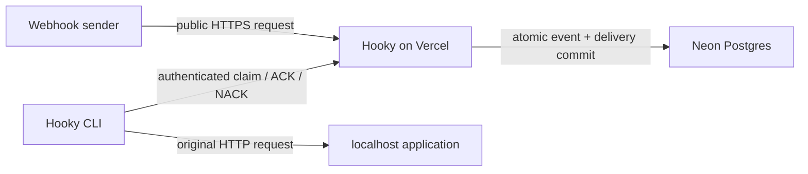

# Hooky

Hooky is a durable webhook inbox and local-development relay. A public Hooky URL accepts and stores a webhook before returning `202`, then the Hooky CLI leases that event and forwards its original method, path, query, headers, and bytes to localhost. Your development machine never exposes a public port.

The hosted application is [hooky.vercel.app](https://hooky.vercel.app). The product plan and implementation decisions live in [PRD issue #1](https://github.com/dak-engineering/hooky/issues/1).

## Use Hooky

Hooky is not published to npm. Run it directly from this public GitHub repository:

```bash
bunx github:dak-engineering/hooky --help
```

Or install the command globally from GitHub:

```bash
bun install --global github:dak-engineering/hooky
hooky --help
```

Create an account in the web app, open **API keys**, and copy a newly created key. Authenticate the CLI:

```bash
hooky login --token hky_your_token
```

Create a new webhook URL and relay its events to a local route:

```bash
hooky listen --new stripe-dev --to http://localhost:3000/webhooks/stripe
```

The command prints the one-time public webhook URL. Give that URL to Stripe, GitHub, Clerk, or any service that sends HTTP webhooks.

To listen on a hook that already exists in your account:

```bash
hooky hooks
hooky listen --hook stripe-dev --to http://localhost:3000/webhooks/stripe
```

The CLI stores credentials in `~/.config/hooky/config.json` with user-only permissions. You can instead use `HOOKY_TOKEN`, `HOOKY_API_URL`, and `HOOKY_CONFIG_PATH`.

## Delivery model



- Hook ingress secrets and API keys are random, one-time credentials stored only as SHA-256 hashes.
- Each accepted request and pending delivery are committed together before Hooky responds.
- A listener claims work using a time-bounded database lease. Unacknowledged work becomes claimable again after the lease expires.
- Successful local responses ACK the delivery. Network errors and unsuccessful responses NACK it with bounded exponential retry.
- Every account boundary is enforced in the database queries used by management and listener APIs.
- Captured events are retained for 30 days by default. A daily authenticated Vercel Cron job performs bounded cleanup.

## Repository

This Bun/Turborepo workspace contains:

- `apps/web`: Next.js application, authenticated dashboard, ingress, management API, listener API, health check, and retention cron.
- `packages/database`: Drizzle schema, migrations, tenant-scoped stores, and PostgreSQL delivery state machine.
- `packages/cli`: GitHub-installable Bun CLI and local forwarding loop.
- `e2e`: Playwright coverage for the landing page and the sign-up → hook → webhook → event → API-key flow.

## Local development

Requirements are Bun 1.3+, PostgreSQL 16+, and Chromium for browser tests.

```bash
bun install
cp .env.example apps/web/.env.local
```

Set these values:

```dotenv
DATABASE_URL=postgresql://...
BETTER_AUTH_SECRET=a-random-secret-at-least-32-characters-long
BETTER_AUTH_URL=http://localhost:3000
CRON_SECRET=another-random-secret
RETENTION_DAYS=30
```

Then migrate and run the application:

```bash
DATABASE_URL='postgresql://...' bun run db:migrate
bun run dev
```

The application runs at [http://localhost:3000](http://localhost:3000). Readiness is available at [http://localhost:3000/api/health](http://localhost:3000/api/health).

Application traffic should use Neon's pooled `DATABASE_URL`. Run migrations with a direct connection string when available because migration tools hold longer sessions than request handlers.

## Validation

Database tests use `TEST_DATABASE_URL` when supplied. Otherwise they create and remove an ephemeral local PostgreSQL cluster.

```bash
bun run prettier
bun run lint
bun run prettier:check
bun run typecheck
bun test
bun run test:e2e
bun run build
bun run db:generate
```

## Deployment

The production project is `dak/hooky` on Vercel, connected to this repository with `apps/web` as its Root Directory. Neon supplies pooled `DATABASE_URL` credentials to the Vercel project. Production also requires `BETTER_AUTH_SECRET`, `BETTER_AUTH_URL`, and `CRON_SECRET`; `RETENTION_DAYS` defaults to 30.

The service emits metadata-only structured ingress logs with Vercel request correlation. It never logs webhook bodies, captured headers, ingress secrets, API keys, or database credentials.
